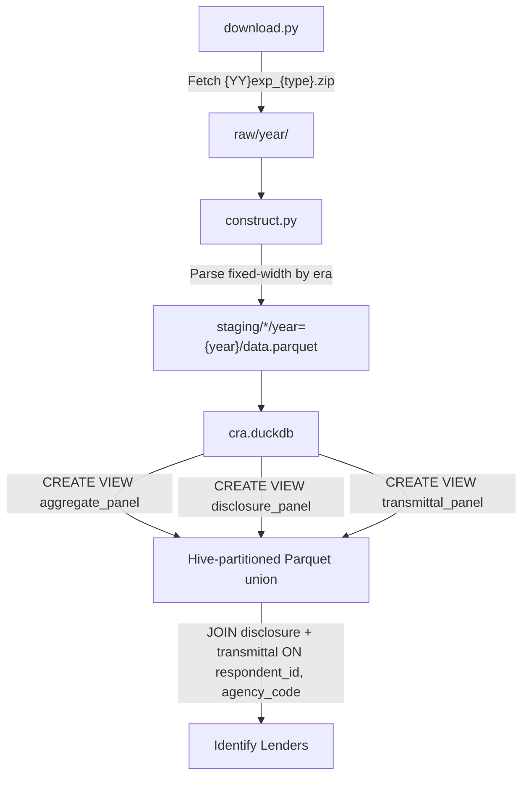

# CRA Data Pipeline Plan

## Data Source

FFIEC CRA flat files from `https://www.ffiec.gov/cra/xls/{YY}exp_{type}.zip` where `YY` is the 2-digit year and `type` is one of `aggr`, `trans`, `discl`. Data available 1996-2024.

All files are fixed-width ASCII `.dat` files. Pre-2016 years pack all tables into a single `.dat` file per type. Post-2016 years split into per-table `.dat` files inside the zip (e.g., `cra2024_Aggr_A11.dat`, `cra2024_Discl_D11.dat`).

## Three DuckDB Tables

### 1. Transmittal (institution register)

Links lenders to disclosure data via `(respondent_id, agency_code)`. Fields:

- respondent_id: pos 1-10 (all years)
- agency_code: pos 11 (all years) -- 1=OCC, 2=FRS, 3=FDIC, 4=OTS
- activity_year: pos 12-15 (all years)
- respondent_name: pos 16-45 (all years)
- respondent_addr: pos 46-85 (all years)
- respondent_city: pos 86-110 (all years)
- respondent_state: pos 111-112 (all years)
- respondent_zip: pos 113-122 (all years)
- tax_id: pos 123-132 (all years)
- rssdid: pos 133-142 (1997+ only; NULL for 1996)
- assets: pos 143-152 (1997+ only; NULL for 1996)

### 2. Aggregate Data (lending by census tract/county)

Focus table: **A1-1** (Small Business Loans by County: Originations). The table ID changes format across eras:

- 1996: `A1-1` (4 chars)
- 1997+: `A1-1 ` (5 chars, space-padded)
- 2016+: Stored in separate file `cra{year}_Aggr_A11.dat`

Three era layouts for field positions:

- **table_id**: 1996 = 1-4, 1997-2003 = 1-5, 2004+ = 1-5
- **activity_year**: 1996 = 5-8, 1997-2003 = 6-9, 2004+ = 6-9
- **loan_type**: 1996 = 9, 1997-2003 = 10, 2004+ = 10
- **action_taken**: 1996 = 10, 1997-2003 = 11, 2004+ = 11
- **state**: 1996 = 11-12, 1997-2003 = 12-13, 2004+ = 12-13
- **county**: 1996 = 13-15, 1997-2003 = 14-16, 2004+ = 14-16
- **msamd**: 1996 = 16-19, 1997-2003 = 17-20, 2004+ = 17-21
- **census_tract**: 1996 = 20-26, 1997-2003 = 21-27, 2004+ = 22-28
- **split_county**: 1996 = 27, 1997-2003 = 28, 2004+ = 29
- **pop_group**: 1996 = 28, 1997-2003 = 29, 2004+ = 30
- **income_group**: 1996 = 29-31, 1997-2003 = 30-32, 2004+ = 31-33
- **report_level**: 1996 = 32-34, 1997-2003 = 33-35, 2004+ = 34-36
- **num_loans_lt_100k**: 1996 = 35-40 (6w), 1997-2003 = 36-41 (6w), 2004+ = 37-46 (10w)
- **amt_loans_lt_100k**: 1996 = 41-48 (8w), 1997-2003 = 42-49 (8w), 2004+ = 47-56 (10w)
- **num_loans_100k_250k**: 1996 = 49-54 (6w), 1997-2003 = 50-55 (6w), 2004+ = 57-66 (10w)
- **amt_loans_100k_250k**: 1996 = 55-62 (8w), 1997-2003 = 56-63 (8w), 2004+ = 67-76 (10w)
- **num_loans_250k_1m**: 1996 = 63-68 (6w), 1997-2003 = 64-69 (6w), 2004+ = 77-86 (10w)
- **amt_loans_250k_1m**: 1996 = 69-76 (8w), 1997-2003 = 70-77 (8w), 2004+ = 87-96 (10w)
- **num_loans_rev_lt_1m**: 1996 = 77-82 (6w), 1997-2003 = 78-83 (6w), 2004+ = 97-106 (10w)
- **amt_loans_rev_lt_1m**: 1996 = 83-90 (8w), 1997-2003 = 84-91 (8w), 2004+ = 107-116 (10w)

Report level values: blank = tract-level, 100 = Income Group Total, 200 = County Total, 210 = MSA/MD Total.

### 3. Disclosure Data (bank-level lending by county)

Focus table: **D1-1** (Small Business Loans by County: Originations). Same table ID format changes as aggregate.

Three era layouts:

- **table_id**: 1996 = 1-4, 1997-2003 = 1-5, 2004+ = 1-5
- **respondent_id**: 1996 = 5-14, 1997-2003 = 6-15, 2004+ = 6-15
- **agency_code**: 1996 = 15, 1997-2003 = 16, 2004+ = 16
- **activity_year**: 1996 = 16-19, 1997-2003 = 17-20, 2004+ = 17-20
- **loan_type**: 1996 = 20, 1997-2003 = 21, 2004+ = 21
- **action_taken**: 1996 = 21, 1997-2003 = 22, 2004+ = 22
- **state**: 1996 = 22-23, 1997-2003 = 23-24, 2004+ = 23-24
- **county**: 1996 = 24-26, 1997-2003 = 25-27, 2004+ = 25-27
- **msamd**: 1996 = 27-30, 1997-2003 = 28-31, 2004+ = 28-32
- **aa_num**: 1996 = 31-34, 1997-2003 = 32-35, 2004+ = 33-36
- **partial_county**: 1996 = 35, 1997-2003 = 36, 2004+ = 37
- **split_county**: 1996 = 36, 1997-2003 = 37, 2004+ = 38
- **pop_group**: 1996 = 37, 1997-2003 = 38, 2004+ = 39
- **income_group**: 1996 = 38-40, 1997-2003 = 39-41, 2004+ = 40-42
- **report_level**: 1996 = 42-43 (2w), 1997-2003 = 42-44 (3w), 2004+ = 43-45 (3w)
- **num_loans_lt_100k**: 1996 = 44-49 (6w), 1997-2003 = 45-50 (6w), 2004+ = 46-55 (10w)
- **amt_loans_lt_100k**: 1996 = 50-57 (8w), 1997-2003 = 51-58 (8w), 2004+ = 56-65 (10w)
- **num_loans_100k_250k**: 1996 = 58-63 (6w), 1997-2003 = 59-64 (6w), 2004+ = 66-75 (10w)
- **amt_loans_100k_250k**: 1996 = 64-71 (8w), 1997-2003 = 65-72 (8w), 2004+ = 76-85 (10w)
- **num_loans_250k_1m**: 1996 = 72-77 (6w), 1997-2003 = 73-78 (6w), 2004+ = 86-95 (10w)
- **amt_loans_250k_1m**: 1996 = 78-85 (8w), 1997-2003 = 79-86 (8w), 2004+ = 96-105 (10w)
- **num_loans_rev_lt_1m**: 1996 = 86-91 (6w), 1997-2003 = 87-92 (6w), 2004+ = 106-115 (10w)
- **amt_loans_rev_lt_1m**: 1996 = 92-99 (8w), 1997-2003 = 93-100 (8w), 2004+ = 116-125 (10w)
- **num_loans_affiliate**: 1996 = 100-105 (6w), 1997-2003 = 101-106 (6w), 2004+ = 126-135 (10w)
- **amt_loans_affiliate**: 1996 = 106-113 (8w), 1997-2003 = 107-114 (8w), 2004+ = 135-145 (10w)

## Geographic Field Harmonization (Mandatory)

### Census Tract (11 characters)

Raw census_tract field is 7 characters (format XXXX.XX). The harmonized output must be an 11-character FIPS tract code:

```
census_tract_fips = LPAD(state, 2, '0') || LPAD(county, 3, '0') || LPAD(REPLACE(census_tract, '.', ''), 6, '0')
```

- 2-digit state FIPS (left-padded with '0')
- 3-digit county FIPS (left-padded with '0')
- 6-digit tract (remove decimal point, left-pad with '0')
- When census_tract is blank or all spaces, set to NULL

Example: state=`06`, county=`037`, tract=`2141.01` -> `06037214101`

### County FIPS (5 characters)

Construct a 5-character county FIPS code:

```
county_fips = LPAD(state, 2, '0') || LPAD(county, 3, '0')
```

- 2-digit state FIPS (left-padded with '0')
- 3-digit county FIPS (left-padded with '0')
- When state or county is blank, set to NULL

Example: state=`06`, county=`037` -> `06037`

Both `census_tract` and `county_fips` are computed columns added during ETL. The raw `state` and `county` fields are also preserved.

## Key Harmonization Decisions

1. **Unified column names**: Regardless of era, all data gets the same harmonized column names (e.g., `num_loans_lt_100k` not era-specific names).
2. **Table IDs**: Normalized to consistent format (e.g., always `A1-1` internally, stripping spaces/hyphens as needed). The `table_id` field is always trimmed.
3. **Census tract**: Always 11-char FIPS (state 2 + county 3 + tract 6) with leading zeros.
4. **County FIPS**: Always 5-char FIPS (state 2 + county 3) with leading zeros.
5. **Monetary values**: All amounts are in thousands of dollars (consistent across all years).
6. **Linking**: Disclosure links to Transmittal via `(respondent_id, agency_code, activity_year)`.
7. **Report level filtering**: Store all report levels; users filter as needed (200 = County Total for most analyses).
8. **Numeric casting**: All count and amount fields are cast to INTEGER/BIGINT. report_level to VARCHAR (trimmed).

## 2024 Validation (First Year to Process)

The pipeline must process 2024 data first and validate against the CRA National Aggregate Table 1 totals. The following expected values come from the official FFIEC publication:

### Business Originations (Table A1-1, loan_type=4, action_taken=1)

Summing across all counties (report_level = 200 or summing all tract-level records):

- num_loans_lt_100k: **8,300,199**
- num_loans_100k_250k: **243,526**
- num_loans_250k_1m: **190,537**
- Total number: **8,734,262**
- amt_loans_lt_100k: **114,749,317** (thousands)
- amt_loans_100k_250k: **40,555,584** (thousands)
- amt_loans_250k_1m: **102,536,392** (thousands)
- Total amount: **257,841,293** (thousands)
- num_loans_rev_lt_1m: **4,700,002**
- amt_loans_rev_lt_1m: **89,132,044** (thousands)

### Business Purchases (Table A1-2, loan_type=4, action_taken=2)

- num_loans_lt_100k: **332,194**
- num_loans_100k_250k: **26,266**
- num_loans_250k_1m: **13,486**
- Total number: **371,946**

### Farm Originations (Table A2-1, loan_type=5, action_taken=1)

- num_loans_lt_100k: **154,587**
- num_loans_100k_250k: **24,914**
- num_loans_250k_1m: **15,987**
- Total number: **195,488**

The `construct.py` script must include a validation step that sums aggregate data for 2024 and compares against these totals, reporting any mismatches.

## Architecture (mirroring HMDA pipeline)

```
cra/
  download.py      -- Download + extract logic with resume, manifest
  construct.py     -- Fixed-width parsing -> Parquet -> DuckDB views
  metadata.py      -- URLs, field layouts for all 3 eras x 3 file types, harmonized names
  schema.py        -- TypedDict definitions + lightweight validation
  plan.md          -- This plan
```

Data storage at `C:\empirical-data-construction\cra\`:

```
raw/{year}/          -- Downloaded zip files
staging/
  aggregate/year={year}/data.parquet
  disclosure/year={year}/data.parquet
  transmittal/year={year}/data.parquet
cra.duckdb           -- Master database with views + metadata
```

## Pipeline Flow



## Processing Order

1. **Process 2024 first** -- download all three file types, parse, stage to Parquet, validate against known totals
2. Then backfill 2023 -> 2004 (2004+ era, same field widths)
3. Then 2003 -> 1997 (1997-2003 era)
4. Finally 1996 (unique layout)

## config.py Changes

Extend [config.py](../config.py) to be dataset-agnostic by accepting a `dataset` parameter (currently hardcoded to `"hmda"`), or create CRA-specific path helpers inside the CRA module. The simpler approach: add CRA path helpers to a `cra/config_cra.py` or parametrize `config.py`.

## Key Implementation Details

### download.py

- URL template: `https://www.ffiec.gov/cra/xls/{YY:02d}exp_{file_type}.zip`
- Three file types: `aggr`, `trans`, `discl`
- Resume support via `Range` headers (same pattern as HMDA)
- Manifest JSON for idempotency
- Extract `.dat` files from zip after download
- Must set `User-Agent` header (FFIEC blocks bare requests)

### metadata.py

- **Era definitions**: 1996, 1997-2003, 2004-2024 (three eras based on field width changes)
- **Fixed-width layouts**: Dict of `{era: list[tuple(field_name, start, width)]}` for each of: aggregate, disclosure, transmittal
- **Table ID registry**: Mapping of canonical table IDs to era-specific IDs and post-2016 filenames
- **Harmonized column names**: Single canonical schema per table type
- **Post-2016 split file handling**: Function to determine if zip contains per-table `.dat` files
- **Census tract SQL**: Expression to construct 11-char FIPS from state + county + tract
- **County FIPS SQL**: Expression to construct 5-char FIPS from state + county

### construct.py

- Use DuckDB `read_csv` with single-column approach for fixed-width parsing
- Parse via SQL `substr()` expressions dispatched by era
- Compute `census_tract` (11-char) and `county_fips` (5-char) during ETL
- Three panel views in DuckDB: `aggregate_panel`, `disclosure_panel`, `transmittal_panel`
- `panel_metadata` table documenting each year's build
- **2024 validation step**: After processing 2024 aggregate data, run validation query comparing sums against known National Aggregate Table 1 totals

### schema.py

- `AggregateRecord`, `DisclosureRecord`, `TransmittalRecord` TypedDicts
- `validate_row_sample()` for each table type

## Example Query: Linking Disclosure to Transmittal

```sql
SELECT
    d.activity_year,
    t.respondent_name,
    t.respondent_state,
    t.rssdid,
    t.assets,
    d.county_fips,
    d.num_loans_lt_100k,
    d.amt_loans_lt_100k
FROM disclosure_panel d
JOIN transmittal_panel t
  ON d.respondent_id = t.respondent_id
  AND d.agency_code = t.agency_code
  AND d.activity_year = t.activity_year
WHERE d.table_id = 'D1-1'
  AND d.report_level = '200'   -- County totals
  AND d.activity_year = 2024
ORDER BY d.county_fips;
```
