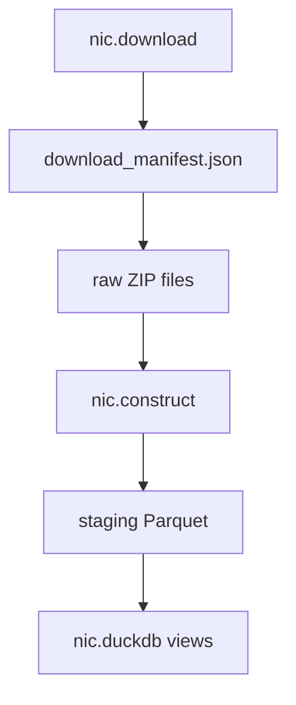

# NIC Data Pipeline Plan

## Data Source

FFIEC National Information Center snapshots from:

- `https://www.ffiec.gov/npw/StaticData/DataDownload/CSV_RELATIONSHIPS.ZIP`
- `https://www.ffiec.gov/npw/StaticData/DataDownload/CSV_TRANSFORMATIONS.ZIP`

The data is not annual. Each ZIP is a rolling historical snapshot that gets replaced when FFIEC publishes updates.

## Update Strategy

Because this is snapshot data, updates are version-based:

1. `download_manifest.json` tracks file metadata (`sha256`, `content_length`, `etag`, `last_modified`, `downloaded_at`).
2. `python -m nic.download --update` performs HEAD checks and only downloads changed files.
3. `python -m nic.download --force` always re-downloads.
4. On new files, rerun construct to rebuild staging Parquet and refresh DuckDB views.

## Storage Layout

```
C:\empirical-data-construction\nic\
├── nic.duckdb
├── download_manifest.json
├── raw\
│   ├── CSV_RELATIONSHIPS.ZIP
│   └── CSV_TRANSFORMATIONS.ZIP
└── staging\
    ├── relationships\data.parquet
    └── transformations\data.parquet
```

## Pipeline Files

- `nic/download.py`: download + update detection
- `nic/construct.py`: ZIP CSV -> Parquet -> DuckDB views
- `nic/metadata.py`: dataset URLs, schema priorities, metadata DDL
- `nic/README.md`: operational + query guide
- `nic/MEMORY.md`: build notes, validation outcomes, troubleshooting

## Build Flow


